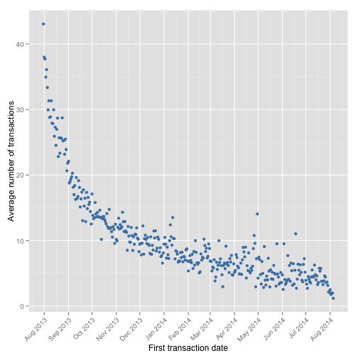

# Ghost Tales transactions analysis

***
## Data Processing
Download CSV-file with data of paying transactions in game Ghost Tales.

```r
setwd('~/source/R/ghost_tales_transactions_analysis')
download.file("https://dl.dropboxusercontent.com/u/1286637/2013-2014%20Ghost%20Tales%20transactions.csv",
              "2013-2014 Ghost Tales transactions.csv", method = "curl")
```
Read data from file and convert dates

```r
data <- read.csv2("2013-2014 Ghost Tales transactions.csv")
data$transaction_date <- as.POSIXct(strptime(data$transaction_date, "%d.%m.%Y"))
data$install_date <- as.POSIXct(strptime(data$install_date, "%d.%m.%Y"))
```

***
## Getting metrics for each player

In the section we calculate:

 * **Recency** - How recently did the customer purchase?
 * **Frequency** - How often do they purchase?
 * **Monetary Value** - How much do they spend?
 
Recency, Frequency and Monetary Value histograms are split into 5 areas for RFM analysis, that is performed later.
 
We also can calculate **lifespan**, **paying lifecycle** and **period to first transaction**.


```r
library(dplyr)
library(ggplot2)
```

### Recency

Filter last transaction_date for each ID

```r
lastData <- summarise(group_by(data, id), last_transaction_date = max(transaction_date))
```

Recency is calculated by subtracting last transaction date for each player from the end of the tracked period:

```r
RFM <- mutate(lastData, recency = difftime(max(last_transaction_date),
                                           last_transaction_date, units = "days"))
```
 

The histogram shows that a lot of people have made transactions recently.

### Frequency

Frequency is the number of transactions for each ID:

```r
numData <- summarise(group_by(data, id), frequency = length(transaction_date))
RFM <- merge(RFM, numData, by = "id")
```
 

### Monetary Value

Monetary value is the sum of values from all transactions for each ID divided by Frequency:

```r
sumData <- summarise(group_by(data, id), gross_monetary = sum(value))
RFM <- merge(RFM, sumData, by = "id")
RFM <- mutate(RFM, monetary = gross_monetary / frequency)
```
 

Head of the data frame with Recency, Frequency and Monetary Value calculated for each player:

```r
head(RFM[, c(1,3,4,5,6)])
```

```
##         id  recency frequency gross_monetary monetary
## 1 83375576  15 days        27         677000 25074.07
## 2 88811298 103 days        24         207000  8625.00
## 3 89529026   0 days        97        1338000 13793.81
## 4 96088480 351 days         1           2000  2000.00
## 5 98563064 156 days         4          50000 12500.00
## 6 99275044 339 days         7          77000 11000.00
```

### Lifespan, Paying lifecycle and period to first transaction

In this section we calculate:

* Lifespan - time from install date until the last transaction for each player
* Paying lifecycle - time from first transaction until the last transaction for each player
* Period to first transaction

Let's see if there are players, that installed the game more that once:

```r
nrow(unique(data[, c("id", "install_date")]))
```

```
## [1] 127216
```

```r
nrow(RFM)
```

```
## [1] 68312
```

We see, that some IDs have several install_date's. We get the first install_date in that case:

```r
instData <- summarise(group_by(data, id), first_install_date = min(install_date))
fTranData <- summarise(group_by(data, id), first_transaction_date = min(transaction_date))
RFM <- merge(RFM, instData, by = "id")
RFM <- merge(RFM, fTranData, by = "id")
rm(instData)
rm(fTranData)
RFM <- mutate(RFM, lifespan =
                  difftime(last_transaction_date, first_install_date, units = "days"),
              paying_lifecycle =
                  difftime(last_transaction_date, first_transaction_date, units = "days"),
              period_to_first_transaction = lifespan - paying_lifecycle)
```

Average Lifespan is **173** days. Average Paying lifecycle is **93** days. Average period to first transaction is **81** days.

Let's plot histograms and mean values for the 3 metrics we've calculated:
   

***
## LTV (Life Time Value of a Customer)

Resource: <http://en.wikipedia.org/wiki/Customer_lifetime_value>

### Calculating Retention Rate

Resource: <http://www.inc.com/jeff-haden/best-way-to-calculate-customer-retention-rate.html>

Retention Rate = ((CE-CN)/CS))

 * CE - number of customers at end of period
 * CN - number of new customers acquired during period
 * CS - number of customers at start of period

Average paying lifecycle ~ 93 days, calculate Retention Rate per month (Purchase cycle):

```r
min(data$transaction_date)
```

```
## [1] "2013-08-01 MSK"
```

```r
max(RFM$last_transaction_date)
```

```
## [1] "2014-08-06 MSK"
```
=> get period from sept.13 to jul.14 (we have hole month track only in this period)

```r
retentionRate <- data.frame(beginning_of_period =
                                seq(as.POSIXct("2013/9/1"), by = "month", length.out = 11),
                            retention_rate = rep(NaN, 11))
for (i in 1:(nrow(retentionRate)-1)) {
    t <- retentionRate$beginning_of_period[i]
    tn <- retentionRate$beginning_of_period[i+1]
    CE <- nrow(RFM[(RFM$first_transaction_date < tn) & (RFM$last_transaction_date) >= tn, ])
    CN <- nrow(RFM[(RFM$first_transaction_date >= t) & (RFM$first_transaction_date < tn), ])
    CS <- nrow(RFM[(RFM$first_transaction_date < t) & (RFM$last_transaction_date >= t), ])
    retentionRate$retention_rate[i] <- (CE - CN)/CS
}
```

Average Retention Rate is **71.48%**.

### Calculating LTV

LTV = GM * r / (1 + d - r)

 * GM - gross contribution per customer
 * d - discount rate. The cost of capital used to discount future revenue from a customer. 0 by default.
 * r - retention rate

```r
getLTV <- function(GM, r = 0.75, d = 0) {
    GM * r / (1 + d - r)
}
LTV <- round(getLTV(GM = mean(RFM$gross_monetary), r = avgRetentionRate/100)/100, 2)
```
LTV = **$2946.56**.

***
## Average number of transactions by daily cohorts

Let's use two methods for dividing players into daily cohorts:

* by first transaction date
* by install date


```r
dCohortsFPay <- summarise(group_by(RFM, first_transaction_date),
                          avg_number_of_transaction = mean(frequency))
dCohortsInst <- summarise(group_by(RFM, first_install_date),
                          avg_number_of_transaction = mean(frequency))
```
  

***

## RFM-analisys
Resource: <https://en.wikipedia.org/wiki/RFM_(customer_value)>

Customers are ranked based on their R, F, and M characteristics (that we calculated earlier), and assigned a "score" representing this rank. The higher the RFM score, the more profitable the customer is to the business now and in the future. High RFM customers are most likely to continue to purchase, AND they are most likely to respond to marketing promotions.

Get a RFM score for all IDs:

```r
RFM <- mutate(RFM, Rscore = factor(recency), Fscore = factor(frequency),
              Mscore = factor(ceiling(monetary)))
levels(RFM$Rscore) <- list(a = 0:30, b = 31:60, c = 61:120, d = 121:290,
                           e = 291:max(RFM$recency))
levels(RFM$Fscore) <- list(a = 1, b = 2:5, c = 6:25, d = 26:100,
                           e = 101:max(RFM$frequency))
levels(RFM$Mscore) <- list(a = 2000, b = 2001:4000, c = 4001:6000, d = 6001:10000,
                           e = 10000:max(ceiling(RFM$monetary)))

RFM <- mutate(RFM, Rscore = as.integer(Rscore), Fscore = as.integer(Fscore),
              Mscore = as.integer(Mscore))
RFM <- mutate(RFM, score = Rscore*100 + Fscore*10 + Mscore)
RFM <- mutate(RFM, Rscore = NULL, Fscore = NULL, Mscore = NULL)
```

Generate user segments from RFM score.
Resource: <http://marketingland.com/adding-email-engagement-to-rfm-scoring-10481>


```r
RFM <- mutate(RFM, segment = factor(score))
levels(RFM$segment) <- list(
    Best_repeat = c(555,554,545,544,535,534,525,524,455,454,445,444,435,434,425,424),
    Best_single = c(515,514,415,414),
    Good_repeat = c(553,543,533,523,453,443,433,423,353:355,343:345,333:335,323:325),
    Good_single = c(513,413,313:315),
    Opportunity_within_Recency_repeat = c(552,551,542,541,532,531,522,521,
                                          452,451,442,441,432,431,422,421,
                                          352,351,342,341,332,331,322,321),
    Opportunity_within_Recency_single = c(512,511,412,411,312,311),
    Opportunity_within_Monetary_repeat = c(253:255,243:245,233:235,223:225,
                                           153:155,143:145,133:135,123:125),
    Opportunity_within_Monetary_single = c(213:215,113:115),
    Dormant = c(251,252,241,242,231,232,221,222,211,212,151,152,141,142,131,132,121,122,111,112)
)
```

Head of the data frame with RFM score and segment calculated for each player:

```r
head(RFM[,c("id", "score", "segment")])
```

```
##         id score                            segment
## 1 83375576   145 Opportunity_within_Monetary_repeat
## 2 88811298   334                        Good_repeat
## 3 89529026   145 Opportunity_within_Monetary_repeat
## 4 96088480   511  Opportunity_within_Recency_single
## 5 98563064   425                        Best_repeat
## 6 99275044   535                        Best_repeat
```
 

### Suggestions for player segments

For players, that used to purchase a lot or made big purchases, but have recently stopped (Opportunity_within_Recency_repeat, Opportunity_within_Monetary_repeat) the recommendation is to offer a big discount (for example on coin bundles) or a valuable present (diamonds) with a short expiration date, so that they don't move to the Dormant segment.

For Good_* segments the recommendation is to offer a small single-use discount that does not expire.

For keeping the Best_* segments engaged the advice is to find out what is it that they like in the game (surveys, in-game tracking) and making sure the game is evolving in the right direction.

